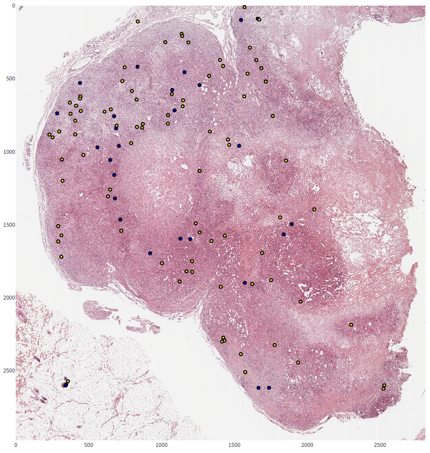
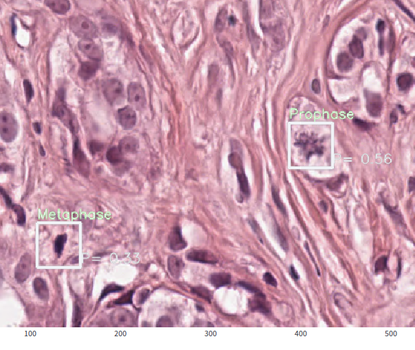
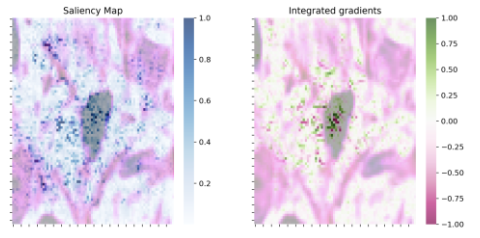
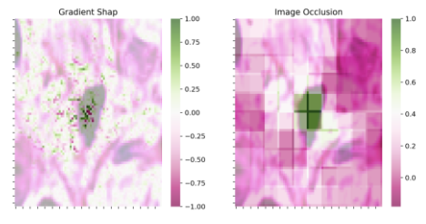
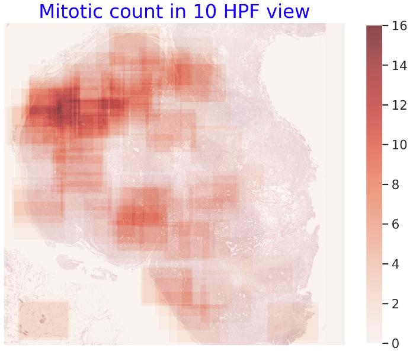
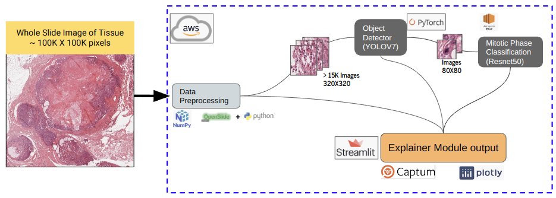

# Explainable-AI-for-Mitotic-Cell-Detection

Explainability is essential and highly desired features in AI system for their adoption in medical field. This enables doctors, medical practitioners as well as patients to gain insight in the decision making process by AI systems. Our web application is designed to aid doctors and medical practitioners in the diagnosis of cancerous tissues from whole slide images.

The App is designed to process whole slide images. It provides the following features:

---

### - Map of all mitotic detection on the Whole Slide image

For this task we segment the original WSI into smaller sized (320 X 320 pixels) patches. We use YOLOV7 for detecting mitotic cells in these small patches. We used the canine breast cancer dataset to train the model.

---

### - Mitotic Phase classification of each Detection

---

### - Visual Explanation of the detection areas using Attribution map

We use the following methods to gain visual Explainable features that contribute to mitotic cell classification

* Saliency Map
* Integrated Gradients
* Occlusion Map
* Gradient Shap

---

### - Heatmap of mitotic count in 10 High Power field

## Data

## Model

## Architecture

We leverage the following packages for building the app:

* Numpy, Openslide Python - Image processing
* YOLOV7 - Mitotic detection in Whole Slide image
* Resnet50 - Mitotic Phase classification
* Pytorch - Model training and Inference
* Captum - Generating visual Explainability features
* Streamlit - Framework for web application
* Plotly - Plotting Images in Streamlit
* EC2 Deep Learning - For Training and Inference
* AWS - for hosting the App

